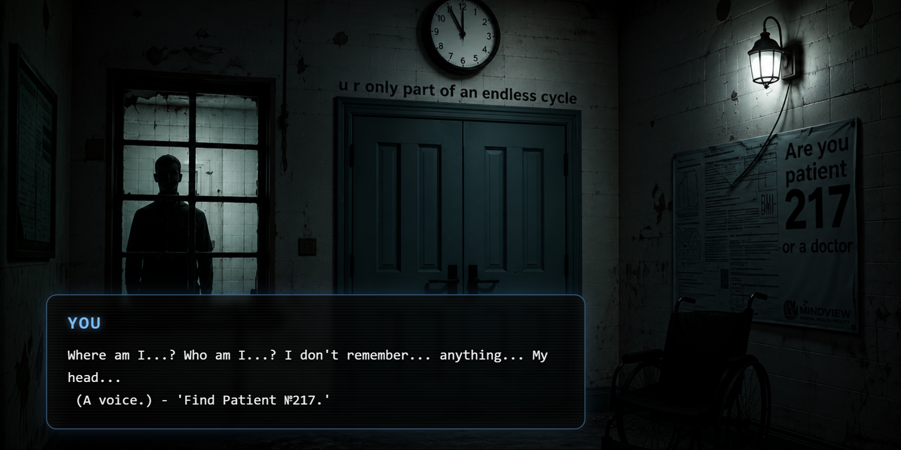
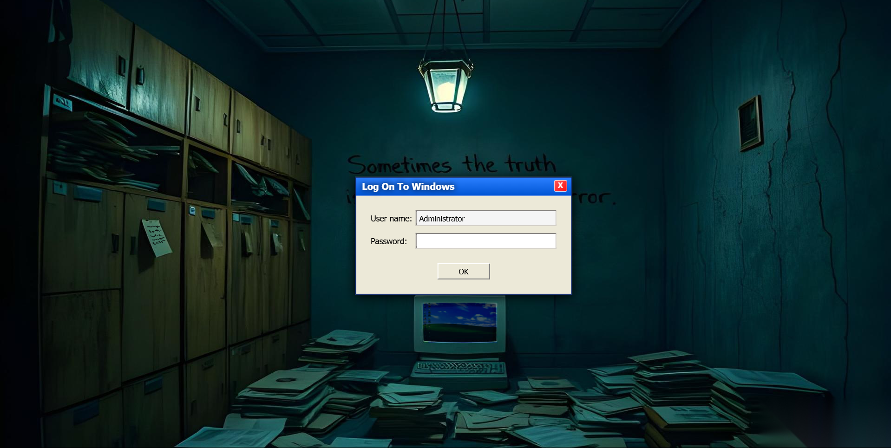
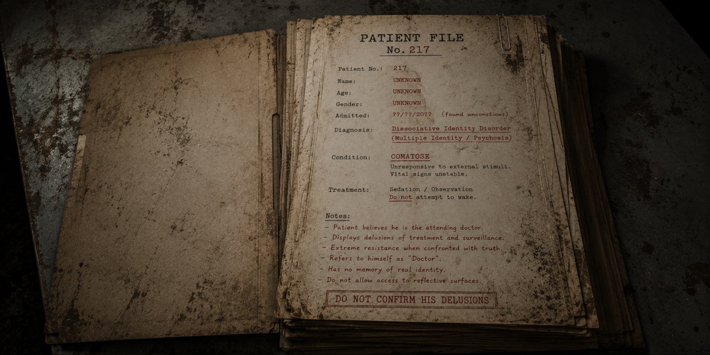

# Patient #217

> An interactive browser-based horror puzzle experience built with vanilla JavaScript, HTML and CSS.

## About

Patient #217 is a story-driven interactive horror quest where the player explores different locations, interacts with objects and solves puzzles to uncover the story.

The project was designed and developed from scratch as a personal project without using frameworks or templates.

## Features

- Multiple interactive scenes and locations
- Puzzle mechanics
- User input and password interactions
- Scene transitions
- Event-driven gameplay
- Custom UI elements
- CSS animations
- Sound effects and audio interactions

## Screenshots







## Technologies

- JavaScript
- HTML5
- CSS3

## What I Built

I developed the project independently, including:

- JavaScript game logic
- Scene navigation and transitions
- Interactive elements and event handling
- Puzzle mechanics
- User input handling
- Custom UI implementation
- CSS animations
- Audio integration
- Debugging and fixing interaction issues

## Project Structure

```text
Patient-217/
├── images/
├── screenshots/
├── sounds/
├── index.html
├── script.js
└── style.css
